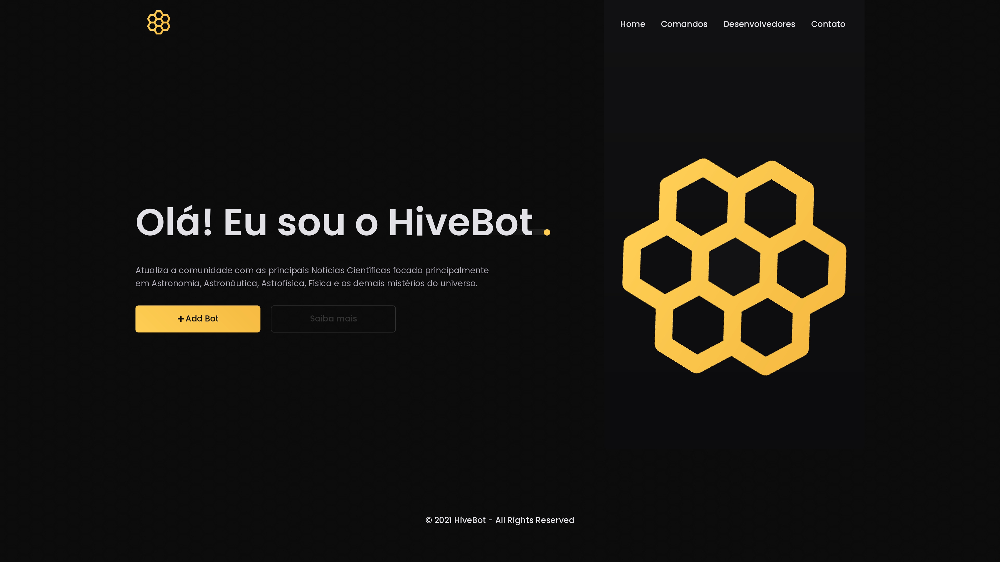
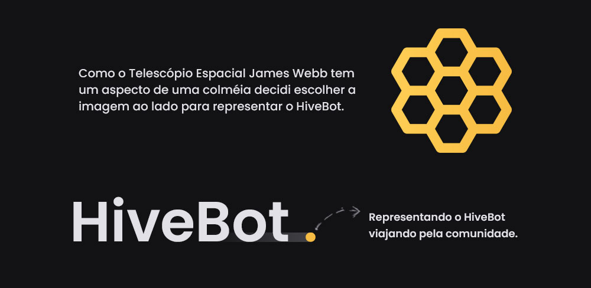

# HiveBot
[Visualizar projeto final](https://malcoon.github.io/Hive-Bot/index.html)

### Inspiração
A idéia surgiu sobre o conteúdo que acompanhei ultimamente que foi o do Sérgio Sacani do Canal SpaceToday e do 
lançamento do Telescópio Espacial James Webb. 

### Preview

### Tecnologias usadas
* HTML
* CSS
* JS
